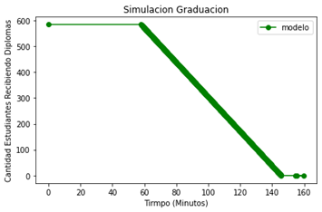
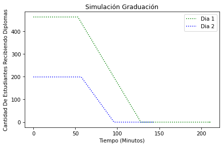
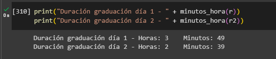

# Simulación acto graduación
## Tabla de contenido

* [Planteamiento del problema](#planteamiento-del-problema)

* [Objetivo General](#objetivo-general)
* [Objetivos Específicos ](#objetivos-específicos)

* [Pasos para el modelado de la simulación](#pasos-para-el-modelado-de-la-simulación)
  * [1.	Analizar el problema.](#1-analizar-el-problema)    

  * [2.	Formular un modelo.](#2-formular-un-modelo)

  * [3.	Abstracción del modelo.](#3-abstracción-del-modelo)

  * [4.	Determinar las variables y las unidades.](#4-determinar-las-variables-y-las-unidades4)

  * [5.	Resolver el modelo.](#5-resolver-el-modelo)

  * [6.	Verificar e interpretar la solución del mode.](#6-verificar-e-interpretar-la-solución-del-modelo)

  * [7.	Análisis de los resultados.](#7-análisis-de-los-resultados)

  * [8.	Informe sobre el modelo.](#8-informe-sobre-el-modelo)

  * [9.  Recomendación](#9-recomendación)

## Planteamiento del problema
Se busca simular un acto de graduación utilizando ModSimPy, una librería de simulación. El objetivo es modelar y analizar diversos aspectos del evento, como el número de graduados, la duración de discursos, la entrega de diplomas y la asistencia de invitados. 

Se pretende responder preguntas sobre el impacto del número de graduados en la duración total, la influencia de los discursos en el tiempo del evento, la relación entre la entrega de diplomas y el tiempo de la graduación. La simulación proporcionará datos para tomar decisiones informadas y mejorar la organización del evento.

## Objetivo General
Desarrollar y ejecutar una simulación utilizando ModSimPy para determinar la duración de un acto de graduación universitaria.

## Objetivos Específicos 
1. Identificar los elementos clave del acto de graduación.

2. Implementar un modelo de simulación que incluya la capacidad de manejar eventos aleatorios.

3. Recomendar mejoras en el modelo de simulación para incluir variables adicionales que pueden afectar la duración del acto de graduación.

## Pasos para el modelado de la simulación

El proyecto consta de los siguientes pasos:
### 1.	Analizar el problema.
Un acto de graduación en una universidad inicia desde el momento en que los graduandos ingresan al recinto y se ubican en sus respectivos lugares asignados. A continuación, se llevan a cabo las siguientes etapas:
- Bienvenida a los invitados.
- Entonación del himno.
- Palabras de la rectoría.
- Toma del juramento (Declaración de compromiso institucional).
- Entrega de diplomas. 
- Reconocimientos a graduados indicados (Los graduados que han sobresalido en la carrera).
- Palabras de los egresados (solo uno).

**Clasificación:** La simulación es estocástica, ya que el comportamiento de las variables depende de eventos aleatorio. Y el modelo es de evento discreto debido a que las variables de estado del sistema permanecen constantes durante los intervalos de tiempo y los valores cambian en puntos definidos.

### 2.	Formular un modelo.
Tomando en consideración que, en un mundo hipotético y ficticio, la población de estudiantes graduados en la universidad oscila entre 500 y 800, incluyendo a los estudiantes de pregrado y postgrado, se va a realizar una simulación del acto de graduación considerando esta población estudiantil.
Los estudiantes de pregrado representan un 91% de la población.
Se asume que el 2% de la población no asiste al acto de la graduación.

¿Cuál sería la duración de la graduación?

¿Qué se necesita cambiar para reducir el tiempo de la graduación?

### 3.	Abstracción del modelo.
**Entidades:** Los graduados.

**Atributos:**

**Grado:** Pregrado y posgrado

### 4.	Determinar las variables y las unidades.
**Variables:**
- Población de estudiantes = 500 a 800
- Estudiantes pregrado = 70% de la población de los estudiantes
- Estudiantes postgrado = 30% de la población de los estudiantes
- Acomodación y apertura de puertas = 15 a 20 minutos
- Entrega de diplomas = poblaciones estudiantes recibiendo los diplomas
- Palabras de los egresados (solo uno) = 15 minutos

### 5.	Resolver el modelo.
Para formar el modelo se tomó como referencia lo siguiente sobre una graduación:
- El día 21 de abril 2022.
- Asistirán a la ceremonia, los 289 .graduandos.
- El día 22 de abril de 2022.
- Asistirán a la ceremonia 351 graduandos.

A continuación, se desglosa cada uno de los momentos que componen el acto:

- Organización de los graduandos según cronograma y protocolo.
- Desfile de autoridades.
- Himno Nacional y de la universidad, interpretado por el coro universitario. 
- Palabras de la rectoría e invitados especiales.
- Entrega de diplomas a los graduandos.
- Juramento de los graduados.
- Entrega de los premios.
- Himno de la universidad interpretado por el coro universitario.
- Salida de autoridades y graduados.

**Entrada:**

- En el primer día está el 70% de la población estudiantil.

- En el segundo día está el 30% de la población estudiantil.

- Acomodación y apertura de puertas.

- Desfile de autoridades.

- Himno Nacional y de la universidad.

- Palabras de la rectoría e invitados especiales.

- Entrega de diplomas a los graduandos.

- Juramento de los graduados.

- Entrega de los premios.

- Discurso en representación de los graduados.

- Himno de la universidad.

- Salida de autoridades y graduados.

**Condiciones Iniciales:**

- Acomodación y apertura de puertas = 15 - 20 minutos

- Desfile de autoridades = 7 - 10 minutos

- Himno Nacional y de la universidad = 6 - 7 minutos

- Palabras de la rectoría e invitados especiales = 20 - 40 minutos

- Entrega de diplomas a los graduandos = 3 - 30 segundos

- Juramento de los graduados = 2 minutos

- Entrega de los premios = 5% - 8% de la población + (15 - 40 segundos por estudiantes)

- Discurso en representación de los graduados = 5 - 8 minutos

- Himno de la universidad = 3 minutos

- Salida de autoridades y graduados 6 - 10 minutos. 

**Comportamiento de la salida (Especulativo):**

Se espera un comportamiento dinámico con las diversas condiciones que tiene el sistema se puede lograr resultados variados para la realización de promedios estadísticos de cómo sería la duración en diversos escenarios.

### 6.	Verificar e interpretar la solución del modelo.
En la primera fase de la prueba del modelo se tomó en cuenta los siguientes factores:

- Bienvenida a los invitados.

- Entonación del himno.

- Palabras de la rectoría.

- Entrega de diplomas. 

- Reconocimientos a graduados indicados.

- Palabras de los egresados (solo uno).

Este es el resultado de aplicar el modelo con lo ya mencionado anteriormente:

Luego se mejoró el modelo tomando como referencia un acto de graduación real agregando siguientes condiciones: 

La graduación se realiza en dos días, el primer día está el 70% de la población estudiantil, el segundo día está el 30% de la población estudiantil. 

En cada acto se lleva a cabo los siguientes pasos:
1.	Acomodación y apertura de puertas.
2.	Desfile de autoridades.
3.	Himno Nacional y de la universidad.
4.	Palabras de la rectoría e invitados especiales.
5.	Entrega de diplomas a los graduandos.
6.	Juramento de los graduados.
7.	Entrega de los premios.
8.	Discurso en representación de los graduados.
9.	Himno de la universidad.
10.	Salida de autoridades y graduados.

Este es el resultado del modelo final:

### 7.	Análisis de los resultados.

El primer día con un 70% de la población de los graduados, la duración del acto es de 3 horas con 49 minutos, mientras que el acto de graduación del día dos 
con un 30% de la población de 
los graduados, tiene la duración de 2 horas con 39 minutos.

Aun dividiendo la población de los graduados en dos días hay otros factores que influyen en su duración como por ejemplo los discursos, y la entrega de los diplomas.

### 8.	Informe sobre el modelo.
El reporte final realizado logró cumplir con diversos puntos establecidos:

- Cumple con el objetivo planteado al inicio.
- El sistema respeta las variables y condiciones planteadas.
- Cumple al 99,9% con el análisis del problema.

### 9.	Recomendación
En síntesis, el modelo se basó en una graduación universitaria, tomando en cuenta las dos gradaciones que realiza la universidad, entonación del himno, juramento de los estudiantes, entrega de diplomas y reconocimientos a algunos graduados.

En ese mismo contexto, algunos factores para utilizar en un modelo futuro:
- Desastre natural.
- Los tiempos que se pierden entre cada etapa de la ceremonia.
- Mal clima.

Notebook con la simualción 
[aquí](#simulación-acto-graduación)